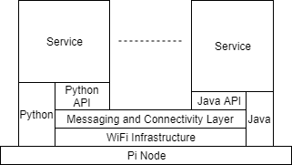

# Pi 'n' Mesh
## Simple Introduction to Extremely Complicated(tm) Things
### Introduction
This project uses Raspberry Pi as the hardware platform, and Raspbian as the OS.
It provides a complete (example) framework of some complex technologies, with an explanation 
of what they are and why they're useful.

Everything is downloaded using apt-get, and there is no building involved. It really is quite
simple.

I've called it a 'mesh' because I liked being able to call the project 'PiNMesh' (pi 'n' mesh)/geddit?
It's not really a mesh, but I'll call it that in this context.

The aim is to have a standalone system (I started with a 4WD 'rover') which allows external clients 
to access a web interface to control the system itself. I can drive my rover and see through it's 
camera.

The mesh itself allows more Pi's to be added but, more importantly, it allows 'services' to be 
developed, in any language you like, that can be treated entirely independently but are easy to
install and integrate - think IoT.

The underlying mechanism uses MQTT (mosquitto here), which is increasingly being used in small device setups.
The Message Queueing concept is widely used in enterprise software, and increasingly in small-things. 
In the mesh, a service has a name and, when it starts, it advertises itself. Then it does whatever it's going 
to do (including waiting to be told to do something). When it needs to, it sends a message, which 
may be picked up by another service. 

No Guarantees!
No account has been taken of security, and everything is approached as simply as possible.
Each of the components has it's own security mechanisms, which should be investigated if you want 
to know more.
Similarly, the system described here pays no attention to persistence - either of messages or other
data - and individual messages may be dropped due to timing etc. (unreliable - but pretty good).
It's entirely up to a service implementor what your service does (and how) - the framework just allows you 
to plug it in.

I have attempted to illustrate the points at which 

<figure>
    
    <figcaption>Mesh Layers</figcaption>
</figure>

#### Requirements
It can be implemented on a single Zero (which is how I started), but is better in the environment 
I describe (1xA+ and a couple/more zeroes, with a B+ as a Gateway).
You'll also need a development machine and environment and a local, wireless router - at least 
for the initial setup.

### Steps
The first chapter is essentially a step-by-step guide to setting up the 'mesh'.
This goes from Initial Install of the OS through to creating the AccessPoint and DNS. After this,
you will have to have a Bridge/Gateway to your internet connection as the system is completely 
self-contained. I've used a B+ for this (and provided instructions) because I wanted a v4 and 
needed an excuse, but you can use any machine/method you like.
By the end we have a standalone mesh which will allow external clients to access it.
The second chapter installs the core software and creates an HttpAdapter to allow network access.
By the end we can use any browser to connect to the mesh and send it a message.

The intention is to provide a standalone platform which, when connected to (it's a DHCP server),
provides a web interface for full control.
When running, it is controllable from any browser which is connected - I use my phone ...

